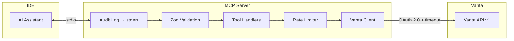

# Vanta MCP Server

> Query Vanta compliance data directly from your IDE using the Model Context Protocol.

An MCP server that connects AI assistants (Cursor, Claude Desktop, etc.) to your Vanta instance, enabling engineers to query compliance tests, view failing entities, and get remediation context without leaving their editor.

## Installation

### From GitHub Releases (recommended)

1. Download `vanta-mcp-server.zip` from [Releases](https://github.com/RiskResponse/vanta-mcp-server/releases)
2. Unzip to a location on your machine (e.g., `~/vanta-mcp-server`)
3. Run the setup script:
   ```bash
   cd ~/vanta-mcp-server
   ./setup.sh
   ```

   The script will:
   - Install dependencies
   - Prompt for your Vanta API credentials
   - Configure Cursor/Claude Desktop automatically

**Or manually:**
```bash
cd ~/vanta-mcp-server
npm install --production
# Then configure your IDE (see below)
```

### From source

```bash
git clone https://github.com/your-org/vanta-mcp-server.git
cd vanta-mcp-server/mcp-vanta-server
npm install
npm run build
```

## Configuration

### 1. Get Vanta API Credentials

1. Go to **Vanta** → **Settings** → **Developer console**
2. Click **+ Create** to create a new application
3. Select **"Manage Vanta"** as the app type
4. Copy your **Client ID** and **Client Secret**

### 2. Configure Your IDE

The MCP server is configured **globally** — once set up, it works in all your projects.

#### Cursor

Create or edit the global config file:

| OS | Location |
|----|----------|
| macOS/Linux | `~/.cursor/mcp.json` |
| Windows | `%USERPROFILE%\.cursor\mcp.json` |

Add the following (replace paths and credentials):

```json
{
  "mcpServers": {
    "vanta": {
      "command": "node",
      "args": ["/Users/YOUR_USERNAME/vanta-mcp-server/dist/index.js"],
      "env": {
        "VANTA_CLIENT_ID": "your_client_id",
        "VANTA_CLIENT_SECRET": "your_client_secret",
        "VANTA_SCOPES": "vanta-api.all:read"
      }
    }
  }
}
```

#### Claude Desktop

Create or edit the global config file:

| OS | Location |
|----|----------|
| macOS | `~/Library/Application Support/Claude/claude_desktop_config.json` |
| Windows | `%APPDATA%\Claude\claude_desktop_config.json` |

Add the following (replace paths and credentials):

```json
{
  "mcpServers": {
    "vanta": {
      "command": "node",
      "args": ["/Users/YOUR_USERNAME/vanta-mcp-server/dist/index.js"],
      "env": {
        "VANTA_CLIENT_ID": "your_client_id",
        "VANTA_CLIENT_SECRET": "your_client_secret",
        "VANTA_SCOPES": "vanta-api.all:read"
      }
    }
  }
}
```

### 3. Restart Your IDE

Restart your IDE to load the MCP server.

## Available Tools

All tools are **read-only** and declare MCP tool annotations accordingly.

| Tool | Description | Parameters |
|------|-------------|------------|
| `list_failing_tests` | List compliance tests with status `NEEDS_ATTENTION` | `categoryFilter?`, `frameworkFilter?`, `pageSize?`, `pageCursor?` |
| `get_test_details` | Get detailed information for a specific test | `testId` (required) |
| `list_affected_assets` | List entities failing a specific test | `testId` (required), `pageSize?`, `pageCursor?` |
| `suggest_remediation` | Get test details + failing entities for AI-driven remediation guidance | `testId` (required) |

All responses include pagination metadata (`pageInfo`) with cursor-based navigation when applicable.

## Usage Examples

Once configured, ask your AI assistant:

```
What compliance tests are failing?
```

```
Show me details on the screenlock test
```

```
Which resources are affected by test X?
```

```
How do I fix this compliance issue?
```

## Architecture



**Layers:**
- **Audit log** (`src/index.ts`, `src/data/vantaClient.ts`) — Every tool call and API request is logged to stderr with timestamps
- **Validation** (`src/validation.ts`) — Zod schemas enforce argument types and sanitize IDs before they reach tool handlers
- **Tools** (`src/tools/*.ts`) — Business logic: shape API responses for MCP
- **Rate limiter** (`src/rateLimit.ts`) — Sliding-window limiter prevents runaway API usage (default: 60 req/60s)
- **Client** (`src/data/vantaClient.ts`) — OAuth token management, all HTTP to Vanta API with 30s `AbortSignal` timeouts

### Vanta API Endpoints Used

| Tool | Vanta Endpoint |
|------|---------------|
| `list_failing_tests` | `GET /v1/tests?statusFilter=NEEDS_ATTENTION` |
| `get_test_details` | `GET /v1/tests` (filtered client-side by ID) |
| `list_affected_assets` | `GET /v1/tests/{testId}/entities?entityStatus=FAILING` |
| `suggest_remediation` | Combines `/v1/tests` + `/v1/tests/{testId}/entities` |

## Environment Variables

| Variable | Required | Description |
|----------|----------|-------------|
| `VANTA_CLIENT_ID` | Yes | OAuth client ID from Vanta Developer Console |
| `VANTA_CLIENT_SECRET` | Yes | OAuth client secret |
| `VANTA_SCOPES` | No | API scopes (default: `vanta-api.all:read`) |

## Development

```bash
# Install dependencies
npm install

# Run in development mode
npm run dev

# Type check
npx tsc --noEmit

# Build
npm run build

# Run tests
npm test

# Run linter
npm run lint
```

## CI/CD

### Test pipeline (`.github/workflows/release.yml`)

Runs on every push and PR, across Node 18, 20, and 22:

| Step | Purpose |
|------|---------|
| `npm audit --omit=dev` | Catch dependency vulnerabilities |
| `npm run lint` | ESLint with TypeScript rules |
| `npx tsc --noEmit` | Catch type errors before runtime |
| `npm run build` | Ensure the server compiles |
| `npm test` | Unit tests (validation, rate limiter, sanitization) + MCP smoke test (starts the server, validates `tools/list` response over JSON-RPC) |

The build job reuses compiled artifacts from the test job to avoid redundant work.

### CodeQL static analysis (`.github/workflows/codeql.yml`)

Runs on every push, PR, and weekly on Mondays. Uses GitHub's CodeQL engine to detect injection vulnerabilities, prototype pollution, and other security issues in JavaScript/TypeScript.

### Dependabot (`.github/dependabot.yml`)

Automated weekly PRs for:
- **npm dependencies** — grouped by dev/production, with minor+patch dev deps batched into a single PR
- **GitHub Actions versions** — keeps CI action versions current

Releases are created automatically when you push a version tag:

```bash
git tag v1.1.0
git push origin v1.1.0
```

This creates a GitHub Release with a downloadable `vanta-mcp-server.zip` artifact.

## Extending the Server

### Adding New Tools

1. Add a Zod validation schema in `src/validation.ts`:

```typescript
export const ListFrameworksSchema = z.object({
  pageSize: z.number().int().min(1).max(500).optional(),
  pageCursor: z.string().optional(),
});
```

2. Create a tool handler in `src/tools/`:

```typescript
// src/tools/listFrameworks.ts
import { getVantaFrameworks } from "../data/vantaClient.js";

export async function listFrameworks(args: { pageSize?: number; pageCursor?: string }) {
  try {
    const response = await getVantaFrameworks(args);
    const frameworks = response.results?.data ?? [];
    const pageInfo = response.results?.pageInfo;

    return {
      content: [{ type: "text" as const, text: JSON.stringify({ frameworks, pageInfo }, null, 2) }],
    };
  } catch (error: unknown) {
    const message = error instanceof Error ? error.message : String(error);
    return {
      content: [{ type: "text" as const, text: `Error: ${message}` }],
      isError: true,
    };
  }
}
```

3. Register it in `src/index.ts`:

```typescript
import { listFrameworks } from "./tools/listFrameworks.js";
import { ListFrameworksSchema } from "./validation.js";

// Add to the tools array in the ListToolsRequestSchema handler:
{
  name: "list_frameworks",
  description: "List all compliance frameworks in your Vanta account",
  inputSchema: { type: "object", properties: {} },
  annotations: {
    title: "List Frameworks",
    readOnlyHint: true,
    destructiveHint: false,
    openWorldHint: true,
  },
}

// Add to the switch statement in the CallToolRequestSchema handler:
case "list_frameworks":
  return listFrameworks(ListFrameworksSchema.parse(args ?? {}));
```

4. Rebuild and restart your IDE.

### Vanta API Reference

See the [Vanta API Documentation](https://developer.vanta.com/docs/vanta-api-overview) for available endpoints and data models.

### Available Scopes

| Scope | Access |
|-------|--------|
| `vanta-api.all:read` | Read access to all resources |
| `vanta-api.all:write` | Read/write access to all resources |
| `vanta-api.vendors:read` | Read vendor data only |
| `vanta-api.documents:read` | Read documents only |

## Security

- **Input validation**: All tool arguments are validated at runtime with Zod schemas. IDs are sanitized against an allowlist pattern (`^[a-zA-Z0-9_-]+$`) before being interpolated into API URLs.
- **Error sanitization**: API error messages expose only HTTP status codes, not raw response bodies.
- **Read-only by default**: The default OAuth scope is `vanta-api.all:read`. All tools declare `readOnlyHint: true` via MCP tool annotations.
- **Rate limiting**: A sliding-window rate limiter (60 requests per 60 seconds) prevents runaway LLM loops from exhausting your Vanta API quota.
- **Fetch timeouts**: All HTTP requests to the Vanta API use a 30-second `AbortSignal` timeout, preventing hung connections from blocking the server.
- **Audit logging**: Every tool invocation and API request is logged to stderr with ISO 8601 timestamps. Since MCP uses stdio for protocol messages, stderr is safe for logging and visible in your IDE's output panel.
- **Credential handling**: Credentials are passed as environment variables by the IDE, never stored in code. Rotate credentials immediately if exposed.
- **Dependency auditing**: CI runs `npm audit` on every build.

## License

MIT
