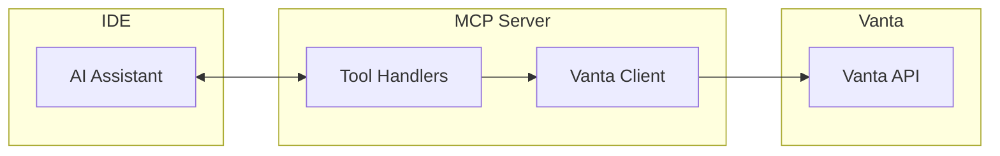

# Vanta MCP Server

> Query Vanta compliance data directly from your IDE using the Model Context Protocol.

An MCP server that connects AI assistants (Cursor, Claude Desktop, etc.) to your Vanta instance, enabling engineers to query compliance tests, view affected resources, and get remediation guidance without leaving their editor.

## Installation

### From GitHub Releases (recommended)

1. Download `vanta-mcp-server.zip` from [Releases](https://github.com/RiskResponse/vanta-mcp-server/releases)
2. Unzip to a location on your machine (e.g., `~/vanta-mcp-server`)
3. Run the setup script:
   ```bash
   cd ~/vanta-mcp-server
   ./setup.sh
   ```
   
   The script will:
   - Install dependencies
   - Prompt for your Vanta API credentials
   - Configure Cursor/Claude Desktop automatically

**Or manually:**
```bash
cd ~/vanta-mcp-server
npm install --production
# Then configure your IDE (see below)
```

### From source

```bash
git clone https://github.com/your-org/vanta-mcp-server.git
cd vanta-mcp-server/mcp-vanta-server
npm install
npm run build
```

## Configuration

### 1. Get Vanta API Credentials

1. Go to **Vanta** → **Settings** → **Developer console**
2. Click **+ Create** to create a new application
3. Select **"Manage Vanta"** as the app type
4. Copy your **Client ID** and **Client Secret**

### 2. Configure Your IDE

The MCP server is configured **globally** — once set up, it works in all your projects.

#### Cursor

Create or edit the global config file:

| OS | Location |
|----|----------|
| macOS/Linux | `~/.cursor/mcp.json` |
| Windows | `%USERPROFILE%\.cursor\mcp.json` |

Add the following (replace paths and credentials):

```json
{
  "mcpServers": {
    "vanta": {
      "command": "node",
      "args": ["/Users/YOUR_USERNAME/vanta-mcp-server/dist/index.js"],
      "env": {
        "VANTA_CLIENT_ID": "your_client_id",
        "VANTA_CLIENT_SECRET": "your_client_secret",
        "VANTA_SCOPES": "vanta-api.all:read"
      }
    }
  }
}
```

#### Claude Desktop

Create or edit the global config file:

| OS | Location |
|----|----------|
| macOS | `~/Library/Application Support/Claude/claude_desktop_config.json` |
| Windows | `%APPDATA%\Claude\claude_desktop_config.json` |

Add the following (replace paths and credentials):

```json
{
  "mcpServers": {
    "vanta": {
      "command": "node",
      "args": ["/Users/YOUR_USERNAME/vanta-mcp-server/dist/index.js"],
      "env": {
        "VANTA_CLIENT_ID": "your_client_id",
        "VANTA_CLIENT_SECRET": "your_client_secret",
        "VANTA_SCOPES": "vanta-api.all:read"
      }
    }
  }
}
```

### 3. Restart Your IDE

Restart your IDE to load the MCP server.

## Available Tools

| Tool | Description |
|------|-------------|
| `list_failing_tests` | Get all failing compliance tests |
| `get_test_details` | Get details on a specific test |
| `list_affected_assets` | List resources failing a specific test |
| `suggest_remediation` | Get remediation guidance for a test |

## Usage Examples

Once configured, ask your AI assistant:

```
What compliance tests are failing?
```

```
Show me details on the screenlock test
```

```
Which resources are affected by test X?
```

```
How do I fix this compliance issue?
```

## Architecture



## Environment Variables

| Variable | Required | Description |
|----------|----------|-------------|
| `VANTA_CLIENT_ID` | Yes | OAuth client ID from Vanta Developer Console |
| `VANTA_CLIENT_SECRET` | Yes | OAuth client secret |
| `VANTA_SCOPES` | No | API scopes (default: `vanta-api.all:read`) |

## Development

```bash
# Install dependencies
npm install

# Run in development mode
npm run dev

# Type check
npx tsc --noEmit

# Build
npm run build
```

## CI/CD & Testing

The GitHub Actions workflow (`.github/workflows/release.yml`) runs on every push and PR:

| Check | Tool | Purpose |
|-------|------|---------|
| Type checking | TypeScript | Catch type errors before runtime |
| Build validation | tsc | Ensure the server compiles |
| Security scan | [mcp-security-scanner](https://pypi.org/project/mcp-security-scanner/) | Check for MCP-specific vulnerabilities |

Releases are created automatically when you push a version tag:

```bash
git tag v1.0.0
git push origin v1.0.0
```

This creates a GitHub Release with a downloadable `vanta-mcp-server.zip` artifact.

## Extending the Server

### Adding New Tools

1. Create a new file in `src/tools/`:

```typescript
// src/tools/listFrameworks.ts
import { vantaFetch } from "../data/vantaClient.js";

export async function listFrameworks() {
  try {
    const response = await vantaFetch<any>("/v1/frameworks");
    const frameworks = response.results?.data || response;

    return {
      content: [{ type: "text", text: JSON.stringify(frameworks, null, 2) }],
    };
  } catch (error: any) {
    return {
      content: [{ type: "text", text: `Error: ${error.message}` }],
      isError: true,
    };
  }
}
```

2. Register it in `src/index.ts`:

```typescript
// Add to imports
import { listFrameworks } from "./tools/listFrameworks.js";

// Add to tools array in ListToolsRequestSchema handler
{
  name: "list_frameworks",
  description: "List all compliance frameworks in your Vanta account",
  inputSchema: { type: "object", properties: {} },
}

// Add to switch statement in CallToolRequestSchema handler
case "list_frameworks":
  return listFrameworks();
```

3. Rebuild and restart your IDE.

### Tool Ideas

| Tool | Description | Vanta API Endpoint |
|------|-------------|-------------------|
| `list_frameworks` | Show active compliance frameworks (SOC 2, ISO 27001, etc.) | `/v1/frameworks` |
| `list_controls` | List controls and their status | `/v1/controls` |
| `get_person_tasks` | Get security tasks for a specific person | `/v1/people/{id}/tasks` |
| `list_vulnerabilities` | Show open vulnerabilities | `/v1/vulnerabilities` |
| `list_vendors` | List third-party vendors and their review status | `/v1/vendors` |
| `get_audit_status` | Get upcoming audit deadlines and progress | `/v1/audits` |
| `list_computers` | Show computers and their compliance status | `/v1/computers` |
| `create_exception` | Request a temporary exception for a test | `POST /v1/exceptions` |

### Vanta API Reference

See the [Vanta API Documentation](https://developer.vanta.com/docs/vanta-api-overview) for available endpoints and data models.

### Available Scopes

| Scope | Access |
|-------|--------|
| `vanta-api.all:read` | Read access to all resources |
| `vanta-api.all:write` | Read/write access to all resources |
| `vanta-api.vendors:read` | Read vendor data only |
| `vanta-api.documents:read` | Read documents only |

## Security

- Store credentials in environment variables, never in code
- Use read-only scopes (`vanta-api.all:read`) unless write access is needed
- Credentials in `mcp.json` are local to your machine
- Rotate credentials if exposed

## License

MIT
